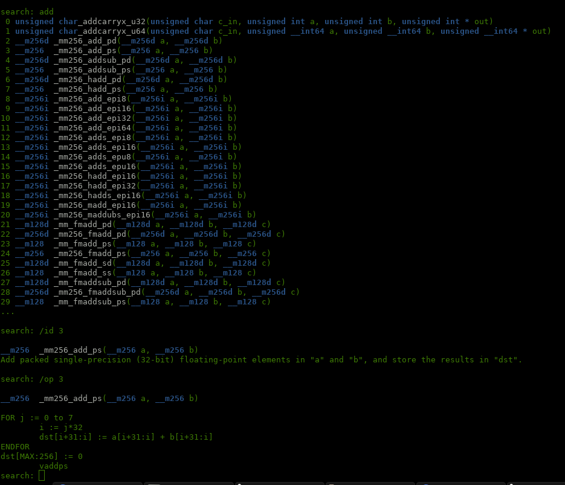

# x86 SIMD Intrinsics Search

This is a small script to search through the many x86 SIMD intrinsics which hopefully is less janky than the Intel website.
Also it doesn't suffer from outages any time they update their XML.




## Usage

The script is an interactive terminal based search engine. Entering a keyword will give you a list of intrinsics which contain the keyword as part of their name.
You can then use `/id n` to look at the description for the `nth` entry in the list.
You can also use `/op n` to get the "operation description" for the `nth` entry.

Availiable search modes are:
```
/rm regex mnemonic search
/asm regex asm mnemonic search
/desc regex description search
/cat regex category search
/tech regex search for tech
```

The number of results shown can be adjusted using `/max`

More commands are shown at startup or when using `/help`

## Blacklisting

There are two different result blacklists you can change in the script.

`cpuid_blacklist` is set to `['AVX512', 'KNCNI']` by default as those are by far not as common and contain a rather large amount of intrinsics that flood the results list.

`techid_blacklist` is set to `['SVML']` by default as those instructions are actually pseudo-instructions only implemented by the intel compiler.

## Updating the XML file

You can find the XML file containing the raw data on the intel site if you want to get access to the latest instruction set. However it seems that they changed the XML structure/names so you might have to modify this script...
